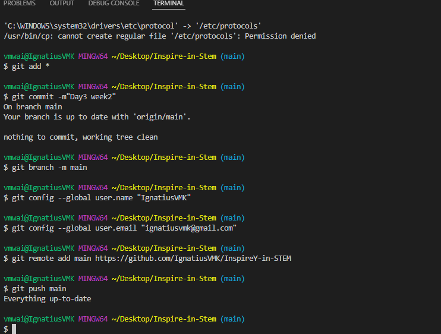
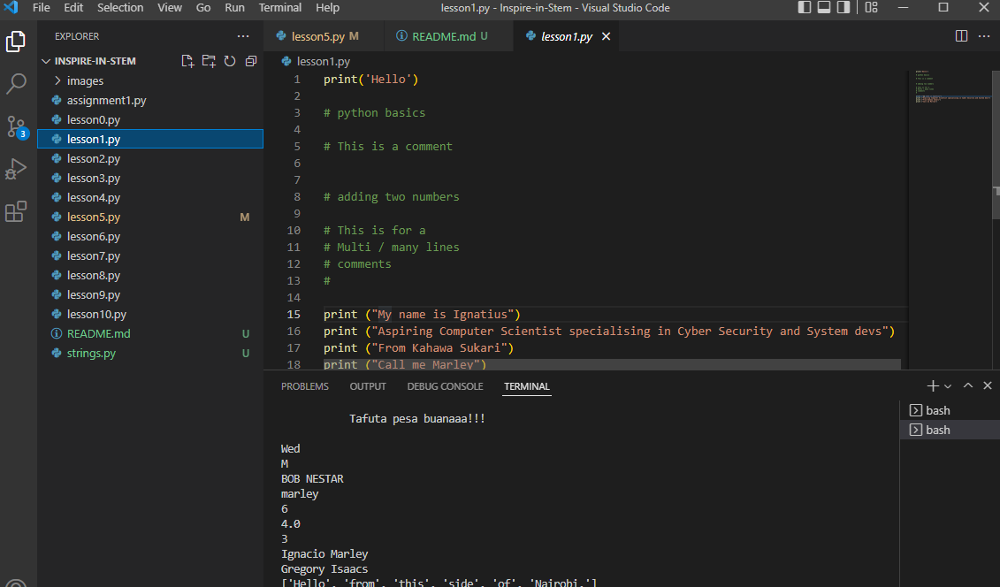
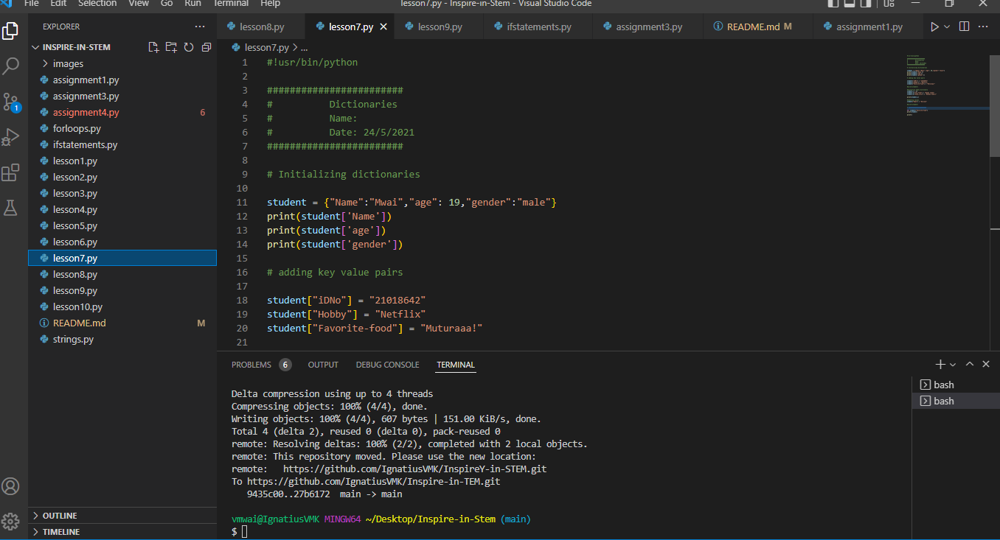
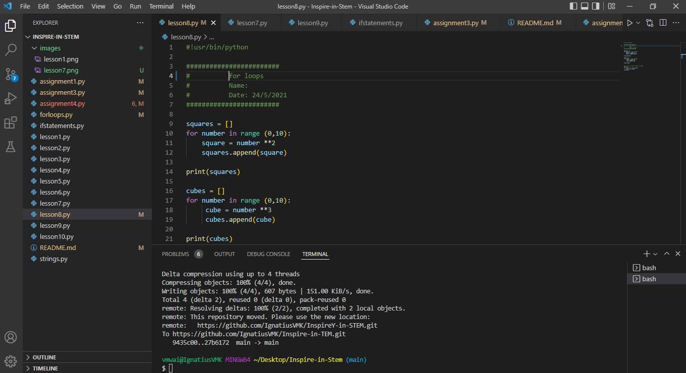

#### Inspire Youth in STEM

## Week 1 : Introduction to Python3
 # Day 1 : Installing Python
 Add a link to python download
   https://www.python.org/downloads/

 Add a link to download VS code
   https://code.visualstudio.com/Download

 Add a link to downloading git for windows
   https://github.com/git-for-windows/git/releases/download/v2.36.1.windows.1/Git-2.36.1-64-bit.exe
 
# Configuring Github:
 git add *
 git commit -m"First commit"
 git git branch -m main
 git config --global user.name "IgnatiusVMK"
 git config --global user.email "ignatiusvmk@gmail.com"
 git remote add main https://github.com/IgnatiusVMK/InspireY-in-STEM
 git push main

 

 

# Day 3:Python Strings
 # (a)strings 
      float()
      int()
      str()
      replace()
      slice()
      strip()
      format() 
      lower()
      len()

# Day 4: Lists and Loops
 # Lists
   accesing list items using index
  adding element in a list
  -append()
  deleting an item from a list-- del
  Removing an item from a list
   Loops
## Week 2 : Electronics for innovators
 # Day 1: Dictionaries
        Initializing dictionaries
        adding key value pairs 
        Initializing empty dictionary 
        modyfing values
        Removing key value pairs

 
Day 2: Lists
       Loops; for loops

## Week 3 : Introduction to Robotics

## Week 4 : JavaScript , Css, html

## Week 5 : Design Thinking, UX, Ui

## Week 6 : Pitch# Inspire-in-TEM
